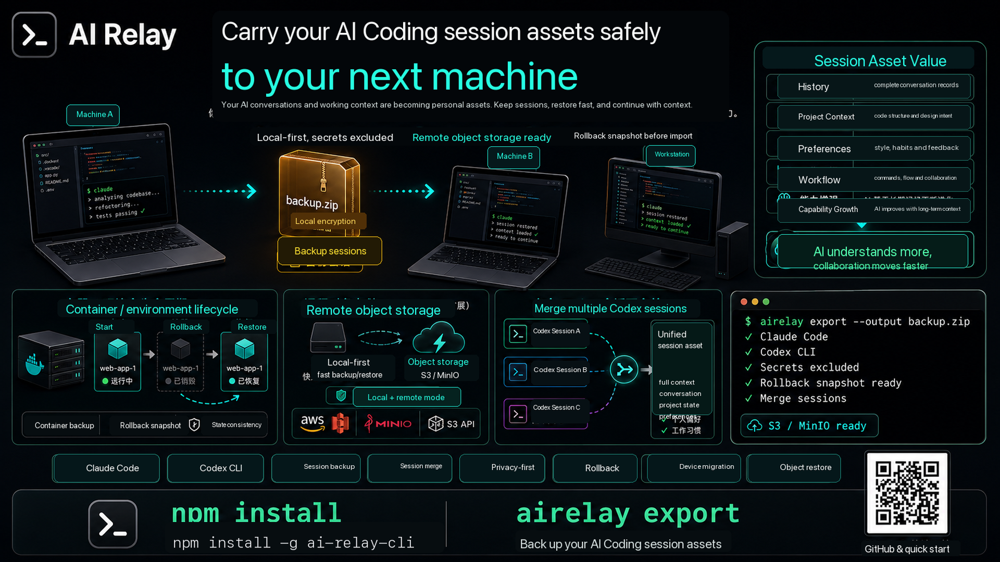

# AI Relay

[English](README.md) | [简体中文](README.zh-CN.md) | [日本語](README.ja.md) | [한국어](README.ko.md)



`airelay` は、ローカルの AI Coding CLI セッションをバックアップ、復元、確認、移行するためのツールです。

現在のデフォルトモードは V1.1 local-first です。

- Claude Code と Codex CLI の検出
- ローカルでの export/import/backup/restore
- バックアップ内容の確認
- ローカルセッションの一覧表示
- 単一セッションのエクスポート
- インポート時はデフォルトで既存ファイルを上書きしない
- インポート前に自動でロールバックスナップショットを作成
- 空の設定をサポート
- V2 クラウド同期はストレージを明示設定した場合のみ有効

## なぜ必要か

AI Coding ツールは重要なセッション履歴をローカルマシンに保存します。PC の移行、環境の再構築、リスクのある変更前に `.claude` や `.codex` を手作業でコピーすると、ファイルの漏れや誤上書きが起きやすくなります。

AI Relay はこの作業を再現可能な CLI ワークフローにします。

```bash
airelay export --output backup.zip
airelay import backup.zip
airelay rollback
```

デフォルトでは session/history データのみをエクスポートします。`auth.json`、トークン、認証情報、設定ファイル、`.env`、`.pem`、`.key`、cache、tmp、logs、plugins などの機密ファイルは除外されます。

## npm からインストール

公開済みの npm パッケージをインストールします。

```bash
npm install -g ai-relay-cli
```

実行例：

```bash
airelay doctor
airelay export
airelay inspect backup_2026-07-07.zip
airelay import backup_2026-07-07.zip
```

## ローカルビルド

ローカル開発用：

```bash
npm install
npm run build
npm link
```

link 後のコマンドを実行します。

```bash
airelay doctor
airelay export
airelay inspect backup_2026-07-07.zip
airelay import backup_2026-07-07.zip
```

link せずに実行することもできます。

```bash
node dist/index.js doctor
node dist/index.js export --yes
```

## よく使うワークフロー

バックアップを作成：

```bash
airelay export --output backup.zip
```

特定のプロバイダーだけをエクスポート：

```bash
airelay export --only claude --output claude-backup.zip --yes
airelay export --only codex --output codex-backup.zip --yes
```

指定セッションをエクスポート：

```bash
airelay export --session claude:projects/my-project/session.jsonl
```

復元前にバックアップを確認：

```bash
airelay inspect backup.zip
```

既存ファイルを上書きせずに復元：

```bash
airelay import backup.zip
```

別マシン向けにプロジェクトパスを変換して復元：

```bash
airelay import backup.zip --map-path /Users/alice/work=/Users/bob/dev
```

インポート前のスナップショットへロールバック：

```bash
airelay rollback
```

## コマンド

```bash
airelay doctor
airelay ls
airelay export
airelay export --session claude:projects/my-project/session.jsonl
airelay inspect backup.zip
airelay import backup.zip
airelay import backup.zip --map-path /Users/alice/work=/Users/bob/dev
airelay import backup.zip --overwrite
airelay rollback
airelay rollback --list
```

エイリアス：

```bash
airelay backup
airelay restore backup.zip
```

V2 コマンドはストレージ設定後に利用します。

```bash
airelay push
airelay pull
airelay sync
```

## セーフティモデル

`airelay` は local-first かつ保守的な動作をデフォルトにしています。

- デフォルトのエクスポートは session/history のみです。
- `--full` はより広い非機密データを対象にしますが、機密ファイルは除外されます。
- インポートは `--overwrite` を指定しない限り既存ファイルを保持します。
- 各インポート前に `~/.airelay/rollbacks/` へスナップショットを作成します。
- `rollback --list` で利用可能なスナップショットを確認できます。

より広い非機密バックアップ：

```bash
airelay export --full
```

自動化向け：

```bash
airelay rollback --list
airelay rollback pre_import_20260707T150000Z --yes
```

## 設定

`airelay` は現在のディレクトリ、次にユーザー設定ディレクトリから設定を読み込みます。

- `./airelay.config.yml`
- `./airelay.config.yaml`
- `./airelay.config.json`
- `~/.airelay/config.yml`
- `~/.airelay/config.yaml`
- `~/.airelay/config.json`

特定の設定ファイルを使う場合：

```bash
airelay --config /path/to/config.yml ...
```

設定は任意です。空の設定は次と同等です。

```yaml
version: "1.1"
storage:
  type: local
cloud_sync:
  enabled: false
```

最小の MinIO/S3 互換設定：

```yaml
version: "2"
storage:
  type: s3
  bucket: airelay
  region: us-east-1
  endpoint: http://127.0.0.1:9000
  prefix: backups
  access_key_id: minioadmin
  secret_access_key: minioadmin
  force_path_style: true
cloud_sync:
  enabled: true
```

既存のバックアップをアップロード：

```bash
airelay push backup_2026-07-08.zip
```

バックアップをダウンロードして復元：

```bash
airelay pull backup_2026-07-08.zip
```

## プロモーション文言

```text
AI Relay
AI Coding セッションを、次の環境へ安全に
Local-first / Privacy-friendly / Rollback-ready
```

短い説明：

```text
.claude と .codex を手作業でコピーする必要はありません。AI Relay で AI Coding セッションをバックアップ、確認、復元、ロールバックできます。
```

ポスター仕様は [spec.md](spec.md) を参照してください。
